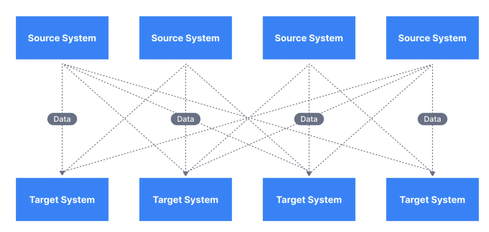

## Concepts
- Apache Kafka is an `open-source`, `distributed`, `event streaming platform` used for building real-time data pipelines and streaming applications.
- competitors
  - RabbitMQ
  - ActiveMQ
  - Apache Pulsar

### Data Integration Challenges
A typical organization has multiple sources of data with disparate data formats. 
Data integration involves combining data from these multiple sources into one unified view of their business.
Each integration comes with difficulties around:
  - **Protocol** – how the data is transported (TCP, HTTP, REST, FTP, JDBC…)
  - **Data format** – how the data is parsed (Binary, CSV, JSON, Avro…)
  - **Data schema & evolution** – how the data is shaped and may change

These direct integrations can result in a complicated solution as shown below.



Apache Kafka allows us to decouple data streams and systems.


### Kafka Components
- **Record**
  - data or event
- **Topic**
  - is a category or feed name to which records are published by producers.
  - Topics act as channels through which data is organized and distributed.
- **Producer**
  - responsible for publishing (producing) records to Kafka Topic
- **Consumer**
  - subscribe to Kafka topics and process the records published to those topics.
  - Kafka supports parallel consumption across multiple consumer instances.
- **Broker**
  - is a Kafka server that stores data and serves client requests.
- **Kafka Cluster**
  - Kafka operates as a cluster of brokers to provide fault tolerance and scalability.
- **Partition**
  - Each topic is divided into partitions, which are ordered and immutable sequences of records.
  - this is done to reduce load on one single server. (Kind of sharding A-M on P0, N-Z on P1)
- **Offset**
  - a unique identifier(increasing number starting with 0) assigned to each record within a partition.
  - Offsets allow consumers to keep track of their position in a partition. 
  - Consumers can commit offsets to Kafka to record their progress, enabling reliable and at-least-once message delivery.
- **Consumer Group**
  - Consumers are organized into consumer groups, 
  - where each group shares the responsibility of consuming records from one or more partitions.
  - this enable parallel processing and load balancing.
  - _Each partition within a topic is consumed by only one consumer within a group, but multiple partitions can be processed simultaneously by different consumers in the group._
- **Zookeeper**
  - Kafka relies on Apache ZooKeeper for distributed coordination and management of its cluster.


### Features:
  - **Distributed**
  - **Fault Tolerant**
    - replicating data across multiple nodes, ensuring data durability and availability.
  - **Scalability**
    - can scale horizontally by adding more broker nodes to the cluster
  - **High Throughput** - reasons listed below
  - **Durability**
    - Data in Kafka is persisted to disk, providing durability even in the case of node failures.
  - **Exactly-Once Semantics**
    -  supports exactly-once semantics for message delivery, ensuring that messages are processed and delivered exactly once.


### Why Kafka is so fast?
Fast here means - High Throughput, not low-latency
How does kafka achieve high throughput??
1. Distributed Architecture
   - scale horizontally, distribute the loads
2. Partitioning
   - data in a topic is partitioned(~sharded) across multiple brokers.
   - Each partition is an ordered and immutable sequence of records
   - these partitions are distributed across multiple servers -> hence parallel processing
3. **Log-centric Storage Model**
   - data is written sequentially to an immutable log.
   - highly efficient for both write and read operations, as it minimizes disk seeks and allows for sequential disk I/O
   - `sequential IO >>> random IO` (by order of 100-1000)
   - read/write from SSD > read/write from HDD (by 3-4 times)
4. Batching
   - supports the concept of batched writes, where multiple records are grouped together and written as a batch. 
   - Batching reduces the overhead of individual record writes and improves disk I/O efficiency.
5. **Zero-Copy**
   - Kafka minimizes data copying during data transfer. 
   - Instead of copying data between buffers, Kafka utilizes the operating system's page cache and direct memory access (DMA) techniques to read and write data efficiently. 
   - This zero-copy approach reduces CPU and memory overhead, contributing to faster performance.
6. Batch Processing and Stream Processing
   - Kafka supports both batch processing and stream processing. 
   - Batch processing allows for efficient handling of large volumes of data, 
   - while stream processing enables real-time data analysis

### Usecases
- Messaging systems
- Activity Tracking
- Gather metrics from many different locations, for example, IoT devices
- Application logs analysis
- De-coupling of system dependencies
- Integration with Big Data technologies like Spark, Flink, Storm, Hadoop.
- Event-sourcing store

### what Kafka is NOT?
- a database
  - even though it doesn't delete data after processing, it doesn't have analytical capabilities, no query model supported
- Work queues
  - Kafka is made of topics, not queues (unlike RabbitMQ, ActiveMQ, SQS). 
  - **Queues are meant to** scale to millions of consumers and to **delete messages once processed**. 
  - In Kafka data is not deleted once processed and consumers cannot scale beyond the number of partitions in a topic.
- Kafka as a blockchain
  - Kafka topics present some characteristics of a blockchain, where data is appended in a log, and Kafka topics can be immutable, 
  - but lack some key properties of blockchains such as the cryptographic verification of the data, as well as full history preservation.

### Kafka as a Queue vs Pub-Sub
- As a Pub-Sub Model
  - Have multiple consumers in one consumer group, hence data from one partition would be consumed by one consumer only
  - but consumer in another consumer group would still be able to read(pub-sub)
- As a Queue:
  - Have only one consumer in a consumer group
  - now each entry would be read by only one consumer

### How to ensure ordering of messages
Determine if ordering is really necessary?
Considering two events where order matters: insert a name-> update a name 
The update shouldn't happen before insert.

To ensure this?
- write events related to one order to one partition only
- this ensures only one consumer would process these data

**How to ensure ordering in the face of failure?**
Failure might be due to deserialization etc..
lets say, insert failed, then we would not want to update it.

This can be handled by a bit of sanity check:

in this case, check if data has went through insert phase -> check in cache/db or add this piece of info while adding next event.

```java
boolean insertConsumer(data) {
    data.isCreated = True
    createEvent(update, data);
}

boolean updateConsumer(data) {
    if(data.isCreated) {
        do something
    } else {
        log/throw/instrument/fail
    }
}
```

### How producer decides a partition to write to?
The producer will decide target partition to place any message, depending on:
- `Partition id`, if it's specified within the message
- `key % num partitions`, if no partition id is mentioned
- Round robin if neither partition id nor message key is available in the message means only the value is available

### Kafka Rebalancing
- Re-balance is the re-assignment of partition ownership among consumers within a given consumer group.
- A Re-balance happens when:
  - a consumer JOINS the group 
  - a consumer SHUTS DOWN cleanly 
  - a consumer is considered DEAD by the group coordinator. (when consumer crash or is busy with a long-running processing) -> no heartbeats sent in the meanwhile by the consumer to the group coordinator within the configured session interval 
  - new partitions are added

For a Consumer Group:
  - Group Coordinator: is one of the brokers in the cluster
  - Group Leader: is the first consumer that joins a group

Rebalance can be more or less described as follows:
  - The leader receives a list of all consumers in the group from the group coordinator
  - this list will include all consumers that sent a heartbeat recently and which are therefore considered alive
  - the leader is responsible for assigning a subset of partitions to each consumer. 
  - After deciding on the partition assignment (Kafka has a couple built-in partition assignment policies), the group leader sends the list of assignments to the group coordinator, which sends this information to all the consumers.

<hr>

## Setup
- Download [kafka binary](https://kafka.apache.org/downloads)
- Download [zookeeper binary](https://zookeeper.apache.org/releases.html)
- Extract both the zips.
- java version >= 8 required.

```jql
$ tar -xzf kafka.tgz
$ cd kafka_2.13-3.6.1
``` 

- Start the ZooKeeper service
```jql
$ bin/zookeeper-server-start.sh config/zookeeper.properties
```

- Start the Kafka broker service
```jql
$ bin/kafka-server-start.sh config/server.properties
```

## Spring Implementation

- dependency in POM
```xml
<dependency>
    <groupId>org.springframework.kafka</groupId>
    <artifactId>spring-kafka</artifactId>
    <version>3.1.0</version>
</dependency>
```

- Creating Topics Programmatically

We need to add the KafkaAdmin Spring bean, which will automatically add topics for all beans of type NewTopic:
```java
@Configuration
public class KafkaTopicConfig {
    
    @Value(value = "${spring.kafka.bootstrap-servers}")
    private String bootstrapAddress;

    @Bean
    public KafkaAdmin kafkaAdmin() {
        Map<String, Object> configs = new HashMap<>();
        configs.put(AdminClientConfig.BOOTSTRAP_SERVERS_CONFIG, bootstrapAddress);
        return new KafkaAdmin(configs);
    }
    
    @Bean
    public NewTopic topic1() {
         return new NewTopic("baeldung", 1, (short) 1);
    }
}
```

- Create producer configs

```java
package com.neatcode.kafka.config;

@Configuration
class KafkaProducerConfig {

    @Value(value = "${spring.kafka.bootstrap-servers}")
    private String bootstrapServers;

    /**
     * BOOTSTRAP_SERVERS_CONFIG - Host and port on which Kafka is running.
     * KEY_SERIALIZER_CLASS_CONFIG - Serializer class to be used for the key.
     * VALUE_SERIALIZER_CLASS_CONFIG - Serializer class to be used for the value.
     */
    @Bean
    public Map<String, Object> producerConfigs() {
        Map<String, Object> props = new HashMap<>();
        props.put(ProducerConfig.BOOTSTRAP_SERVERS_CONFIG, bootstrapServers);
        props.put(ProducerConfig.KEY_SERIALIZER_CLASS_CONFIG, StringSerializer.class);
        props.put(ProducerConfig.VALUE_SERIALIZER_CLASS_CONFIG, StringSerializer.class);
        return props;
    }

    /**
     * ProducerFactory is responsible for creating Kafka Producer instances.
     * Producer instances are thread safe.
     * Using a single instance throughout an application context will give higher performance.
     */
    @Bean
    public ProducerFactory<String, String> producerFactory() {
        return new DefaultKafkaProducerFactory<>(producerConfigs());
    }

    /**
     * we need a KafkaTemplate, which wraps a Producer instance and
     * provides convenience methods for sending messages to Kafka topics.
     *
     * Consequently, KakfaTemplate instances are also thread safe, and use of one instance is recommended.
     */
    @Bean
    public KafkaTemplate<String, String> kafkaTemplate() {
        return new KafkaTemplate<>(producerFactory());
    }
}

```

- create consumer config

```java
@EnableKafka
@Configuration
class KafkaConsumerConfig {

    @Value(value = "${spring.kafka.bootstrap-servers}")
    private String bootstrapServers;

    @Value(value = "${spring.consumer.group-id}")
    private String consumerGroupId;

    @Bean
    public Map<String, Object> consumerConfigs() {
        Map<String, Object> props = new HashMap<>();
        props.put(ConsumerConfig.BOOTSTRAP_SERVERS_CONFIG, bootstrapServers);
        props.put(ConsumerConfig.GROUP_ID_CONFIG, consumerGroupId);
        props.put(ConsumerConfig.KEY_DESERIALIZER_CLASS_CONFIG, StringDeserializer.class);
        props.put(ConsumerConfig.VALUE_DESERIALIZER_CLASS_CONFIG, StringDeserializer.class);
        return props;
    }

    @Bean
    public ConsumerFactory<String, String> consumerFactory() {
        return new DefaultKafkaConsumerFactory<>(consumerConfigs());
    }

    @Bean
    public KafkaListenerContainerFactory<ConcurrentMessageListenerContainer<String, String>> kafkaListenerContainerFactory() {
        ConcurrentKafkaListenerContainerFactory<String, String> factory = new ConcurrentKafkaListenerContainerFactory<>();
        factory.setConsumerFactory(consumerFactory());
        return factory;
    }
}
```

- create kafka producer
```java
@Service
public class KafkaProducer {

    @Autowired
    private KafkaTemplate<String, String> kafkaTemplate;

    /**
     * The send API returns a CompletableFuture object.
     * If we want to block the sending thread and get the result about the sent message, we can call the get API of the CompletableFuture object.
     * The thread will wait for the result, but it will slow down the producer.
     *
     * Kafka is a fast-stream processing platform.
     * Therefore, it’s better to handle the results asynchronously so that the subsequent messages do not wait for the result of the previous message.
     * We can do this through a callback:
     */
    public void sendMessage(String topicName, String message) {
        CompletableFuture<SendResult<String, String>> future = kafkaTemplate.send(topicName, message);
        future.whenComplete((result, ex) -> {
            if (ex == null) {
                System.out.println("Sent message=[" + message +
                    "] with offset=[" + result.getRecordMetadata().offset() + "]");
            } else {
                System.out.println("Unable to send message=[" +
                    message + "] due to : " + ex.getMessage());
            }
        });
    }
}
```

- create kafka consumer
```java
@Service
public class KafkaConsumer {

    @KafkaListener(topics = "topic_1", groupId = "foo")
    public void listenGroupFoo(String message) {
        System.out.println("Received Message in group foo: " + message);
    }
}

```
